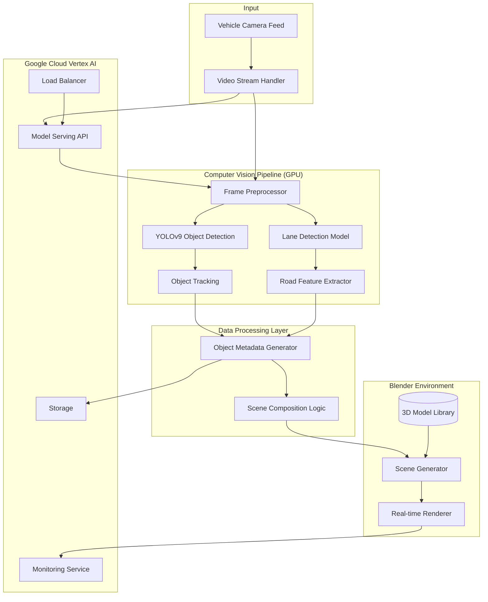

# Tesla Vision Simulator

Real-time simulation system that converts vehicle camera feed into a 3D Blender environment. Uses YOLOv9 for object detection, DeepSORT for tracking, and custom lane detection. The system processes video frames, identifies vehicles, pedestrians, and road features, then generates a corresponding 3D scene in Blender for visualization.

## Setup
1. Create virtual environment: `python -m venv venv`
2. Activate environment: `source venv/bin/activate`
3. Install dependencies: `pip install -r requirements.txt`

## Project Structure
- src/
  - cv_pipeline/: Computer vision components
  - blender_integration/: Blender scene generation
  - utils/: Utility functions
  - config/: Configuration files
- tests/: Unit tests
- models/: Pre-trained model weights
- data/: Input/output data
- logs/: Application logs
- docs/: Documentation files

## System Architecture



### Component Description

1. **Input Layer**
   - Vehicle Camera Feed: Raw input from the front-facing camera
   - Video Stream Handler: Manages real-time video stream and frame extraction

2. **Computer Vision Pipeline**
   - Frame Preprocessor: Normalizes and prepares frames for models
   - YOLOv9: Handles object detection (vehicles, pedestrians, signs)
   - Lane Detection Model: Processes road markings and lanes
   - Object Tracking: Maintains object consistency across frames
   - Road Feature Extractor: Analyzes road geometry and features

3. **Data Processing Layer**
   - Object Metadata Generator: Converts detections to 3D scene metadata
   - Scene Composition Logic: Orchestrates scene elements and transformations

4. **Blender Environment**
   - 3D Model Library: Pre-loaded assets (vehicles, infrastructure)
   - Scene Generator: Creates dynamic 3D environment
   - Real-time Renderer: Renders final output

5. **Cloud Infrastructure**
   - Model Serving API: Handles model inference
   - Load Balancer: Distributes processing load
   - Monitoring Service: Tracks performance metrics
   - Storage: Manages assets and temporary data

## Usage
1. Ensure all dependencies are installed
2. Place YOLOv9 weights in the models directory
3. Run the main script:
```bash
python src/main.py
```

## Contributing
1. Fork the repository
2. Create your feature branch (`git checkout -b feature/AmazingFeature`)
3. Commit your changes (`git commit -m 'Add some AmazingFeature'`)
4. Push to the branch (`git push origin feature/AmazingFeature`)
5. Open a Pull Request

## License


## Acknowledgments
- YOLOv9 for object detection
- DeepSORT for object tracking
- Blender for 3D visualization