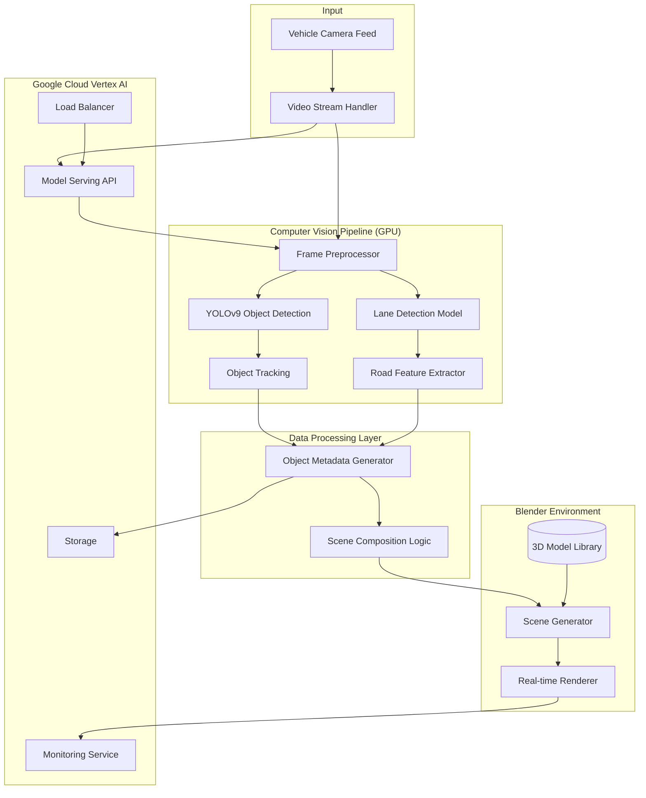

# System Architecture

This document describes the architecture of the Tesla Vision Simulator project.

## High-Level Architecture

## Components Description

### Input Layer
- **Vehicle Camera Feed**: Raw input from the front-facing camera
- **Video Stream Handler**: Manages real-time video stream and frame extraction

### Computer Vision Pipeline
- **Frame Preprocessor**: Normalizes and prepares frames for models
- **YOLOv9**: Handles object detection (vehicles, pedestrians, signs)
- **Lane Detection Model**: Processes road markings and lanes
- **Object Tracking**: Maintains object consistency across frames
- **Road Feature Extractor**: Analyzes road geometry and features

### Data Processing Layer
- **Object Metadata Generator**: Converts detections to 3D scene metadata
- **Scene Composition Logic**: Orchestrates scene elements and transformations

### Blender Environment
- **3D Model Library**: Pre-loaded assets (vehicles, infrastructure)
- **Scene Generator**: Creates dynamic 3D environment
- **Real-time Renderer**: Renders final output

### Cloud Infrastructure
- **Model Serving API**: Handles model inference
- **Load Balancer**: Distributes processing load
- **Monitoring Service**: Tracks performance metrics
- **Storage**: Manages assets and temporary data
